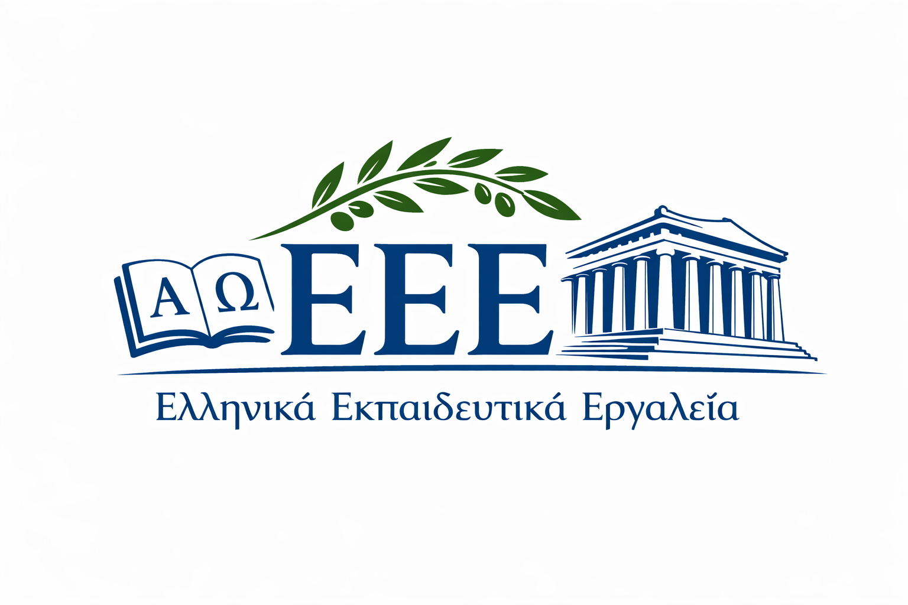

<p align="center">
  
</p>

# Ελληνικά Εκπαιδευτικά Εργαλεία (EEE) — Greek Language Educational Tools

**EEE** is a framework for building interactive [Marimo](https://marimo.io) notebooks with automatic morphological validation for Greek language learning. It enables instructors and learners to create custom interactive educational materials with word-form testing exercises.

## Framework Overview

This is not just a collection of exercises — it's a reusable framework for:
- **Educators & Methodologists**: Embed interactive tests directly into teaching materials; create exercises from your own word lists and course notes
- **Students**: Systematize notes with interactive assignments; build personalized tests from required vocabulary
- **Developers**: Use the modular architecture to extend with new test types, languages, or morphological features

## Example Applications

Two ready-to-use example notebooks demonstrating the framework:
- **Noun Declension Tester**: https://molab.marimo.io/notebooks/nb_KZYjBCXm1jiSjMBnvxWezi/app
- **Verb Conjugation Tester**: https://molab.marimo.io/notebooks/nb_HJPdFCQMSBvpw3EafKK88v/app

These examples showcase the framework capabilities: built-in word samples, custom CSV/TSV upload, automatic form generation, real-time validation.

## Project Structure

### Framework Components
- **`greek_utils.py`**: Core utility module with morphological validation, UI components, and test harness logic

### Example Applications (built with the framework)
- **`examples/greek_nouns.py`**: Interactive notebook for practicing noun declensions (Simple and with Articles)
- **`examples/greek_verbs.py`**: Interactive notebook for practicing verb conjugations (supports Present, Imperfect, Aorist, Future, Continuous Future, Subjunctive)
- **`examples/greek_adjectives.py`**: Interactive notebook for practicing adjective declensions

## Prerequisites

- **Python 3.12+**
- **Marimo** (reactive notebook for Python)
- **modern-greek-inflexion** (morphological engine)

## Installation

1.  **Clone the repository**:
    ```bash
    git clone https://github.com/EEE-project/modern-greek-eee.git
    cd modern-greek-eee
    ```

2.  **Install dependencies**:
    We recommend using a virtual environment:
    ```bash
    python -m venv .venv
    source .venv/bin/activate
    pip install -e .
    ```

## Running the Notebooks

You can run the notebooks in "edit" mode (to see the code) or "app" mode (for a clean interface).

### For Nouns:
```bash
marimo edit examples/greek_nouns.py
# OR
marimo run examples/greek_nouns.py
```

### For Verbs:
```bash
marimo edit examples/greek_verbs.py
# OR
marimo run examples/greek_verbs.py
```

### For Adjectives:
```bash
marimo edit examples/greek_adjectives.py
# OR
marimo run examples/greek_adjectives.py
```

## How to Work with the Forms

### 1. Load Data
By default, the notebooks come with a few sample words. You can also upload your own **TAB-delimited CSV** file using the "Load CSV" button. The file should have `Word` and `Translation` columns.

### 2. Select Words
Check the boxes next to the words you want to practice in the table. The notebooks will randomly cycle through these selected words until all are completed.

### 3. Practice Forms
- **Nouns**: Fill in the required declensions (Simple or with Articles). Both forms are synchronized to practice the same word.
- **Verbs**: Input all 6 persons (Sg/Pl) for the current tense. 
    - **Future forms** (Simple/Continuous) require the **`θα `** prefix (e.g., `θα γράψω`).
    - **Subjunctive forms** (Simple/Continuous) require the **`να `** prefix (e.g., `να γράψω`).
    - **Perfect forms** require the **`έχω `** prefix (e.g., `έχω γράψει`).
- **Feedback**: After pressing the **"Check"** button, the system will provide immediate feedback. Errors are highlighted in red with the expected result shown.

### 4. Progression
Once you correctly fill in all forms for a word, it is automatically removed from the "Words to Test" list. A progress counter (e.g., `3/6 words remaining`) keeps you updated.

## Creating Custom Applications

The framework is modular and extensible:

### Adding New Tenses
Update the `VERB_TENSE_CONFIG` in `greek_utils.py`. Currently supported:
- Present (Ενεστώτας)
- Imperfect / Past Continuous (Παρατατικός)
- Aorist (Αόριστος)
- Simple Future (Στιγμιαίος Μέλλοντας)
- Continuous Future (Συνεχής Μέλλοντας)
- Simple Subjunctive (Στιγμιαία Υποτακτική)
- Continuous Subjunctive (Συνεχής Υποτακτική)
- Perfect (Παρακείμενος)

### Adding New Test Types
The framework supports noun and verb testing. You can:
- Create new test modules by following the patterns in `greek_utils.py`
- Use the `modern-greek-inflexion` library for morphological analysis
- Implement custom validation logic for new grammatical features

### Recommended Workflow for Educators
1. **Prepare materials**: Organize teaching content (textbooks, notes, vocabularies) + reference to this framework
2. **Generate descriptions**: Use NotebookLM or similar to create structured descriptions of topics and exercises
3. **Human review**: Iterate on the descriptions to ensure accuracy and clarity
4. **Generate notebook**: Use an AI tool (Antigravity, Claude Code, Gemini CLI, Codex, etc.) to generate a Marimo notebook from the description
5. **Deploy**: Use the notebook as part of your course materials

### Customization
- Modify `marimo.App` settings to adjust styling, layout, or behavior
- Create custom CSS files for theme changes
- Adjust form field labels and UI strings via the translation system (English, Russian, Greek supported)
